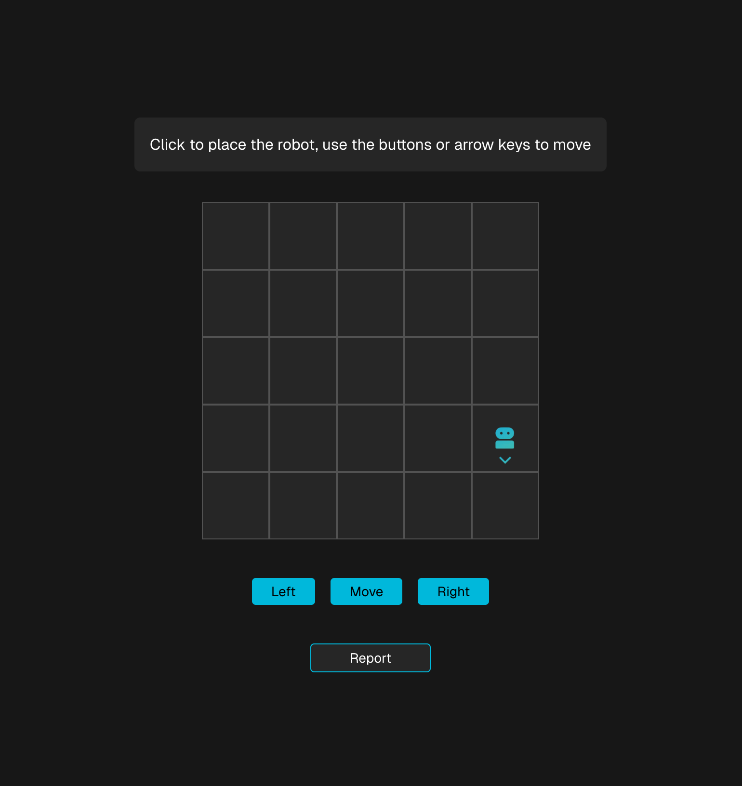

# Toy Robot Simulator

This project is a toy robot simulator. It simulates a robot moving on a 5x5 grid surface.



#### Technologies Used
- Nuxt.js
- React.js
- Jest
- Node.js (v20.19.1)

## Getting Started

First, run the back end Nuxt.js API server:

```bash
cd server
npm install
npm run dev
```
The Nuxt.js API will run at [http://localhost:3001](http://localhost:3001).

Next, run the front end React.js app:

```bash
cd front-end
npm install
npm run dev
```
The Nuxt.js front end will run at [http://localhost:3000](http://localhost:3000). View the page in your browser and start playing with the robot!

## Testing
Tests were created in Nuxt.js using Jest. To run these tests run the following command for the API server tests:

```bash
cd server
npm install
npm run test
```

For the front end tests:

```bash
cd front-end
npm install
npm run test
```

## Author
Adrian Iannantuono
aiannantuono@me.com